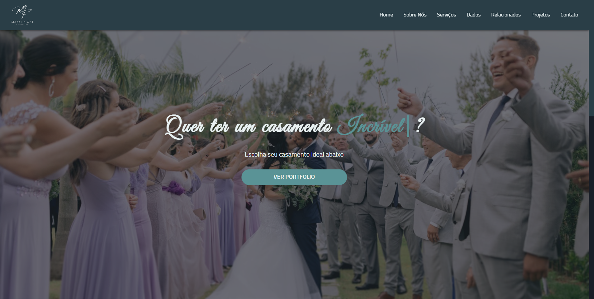

# Mazzi Fiori Casamentos

> In this repository you will find a landing page for a wedding company, that is, a company that is responsible for the complete realization of the wedding, making the customer choose between the types of wedding and that's all.

## Table of contents

- [Overview](#overview)
  - [The challenge](#the-challenge)
  - [Links](#links)
  - [Screenshot](#screenshot)
- [My process](#my-process)
  - [Built with](#built-with)

## Overview

### The challenge

Users should be able to:

- Choose between different types of weddings
- Contact the company
- Scroll the page freely
- View all page information
- View all photos
- Get more information about weddings

### Links

- Live Site URL: https://mazzi-fiori-casamentos.netlify.app

### Screenshot

  - Desktop
  
    
    
  - Mobile
    
    

## My process

### Built with

- HTML
- CSS
- JAVASCRIPT

[⬆ Back to the top](#mazzi-fiori-casamentos) 
